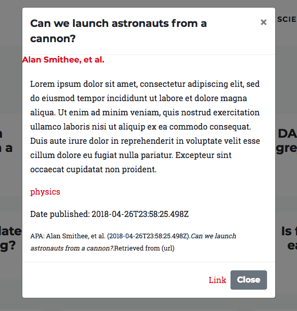
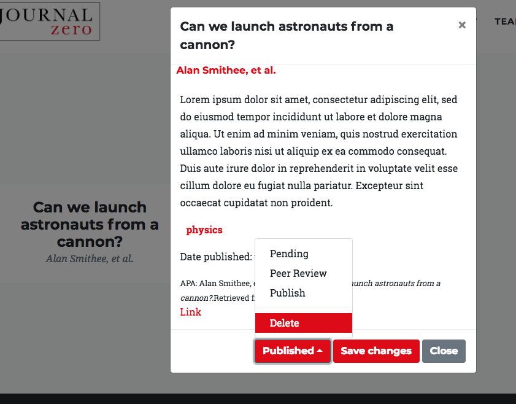

# Journal Zero

*[Dustin Ruskell](https://github.com/ventronik "Dustin Ruskell's GitHub")*

Journal Zero is a full stack App that allows users to post papers with different status'.

Journal Zero was created in 1 week.

### Deployed here: http://journal-zero.surge.sh/index.html
### Backend Deployed here: https://obscure-falls-76162.herokuapp.com
#### Frontend GitHub: https://github.com/Ventronik/JournalZeroFE
#### Backend GitHub: https://github.com/Ventronik/JournalZeroBE

## To deploy locally
- Fork and clone this repository
- npm install
- live-server is the recommended deployment method

## Features
- Send and retrieve authenticated data from server using REST API
- Login via jwt and bcrypt

## Technologies
#### Frontend
- JavaScript
- AJAX/axios

#### Backend
- Node.js
- Express.js
- Knex.js
- PostgreSQL
- Authentication via jwt and bcrypt
- Custom RESTful API
- JavaScript

## Screenshots

### Splash Page:

### Published paper date:

### Logged In:

### Publishing a paper:

